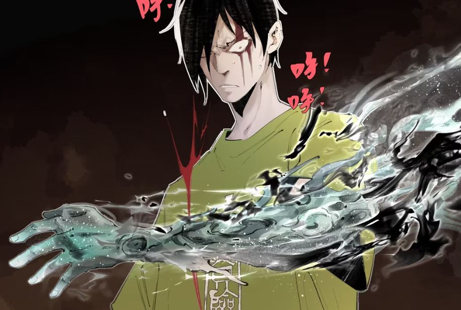

<div align="center">


</div>
<p align="center">
       🖥️  <a href="https://github.com/bilibili/Index-anisora/tree/main">GitHub</a> &nbsp&nbsp  |  &nbsp&nbsp🤗 <a href=https://huggingface.co/IndexTeam/Index-anisora>Hugging Face</a>&nbsp&nbsp |  &nbsp&nbsp🤖 <a href=https://www.modelscope.cn/organization/bilibili-index>Model Scope</a>&nbsp&nbsp | 📑 <a href='http://arxiv.org/abs/2412.10255'></a> &nbsp&nbsp ｜  📑 <a href='http://arxiv.org/abs/2504.10044'></a> &nbsp&nbsp

**English** | [**中文简体**](./README_CN.md)

<br>

----

[**Index-AniSora:The Ultimate Open-Source Anime Video Generation Model**](http://arxiv.org/abs/2412.10255) <be> 

This Project presenting Bilibili's gift to the anime world - Index-AniSora, the most powerful open-source animated video generation model.
It enables one-click creation of video shots across diverse anime styles including series episodes, Chinese original animations, manga adaptations, VTuber content, anime PVs, mad-style parodies(鬼畜动画), and more!
Powered by our IJCAI'25-accepted work  <a href='http://arxiv.org/abs/2412.10255'>AniSora: Exploring the Frontiers of Animation Video Generation in the Sora Era </a>

## Video Demos

<div align="center">
    <video src="https://github.com/user-attachments/assets/0fe90036-7634-4d98-9a7e-6719d2acdb48" controls width="60%" poster=""></video>
</div>


VTubers is comming. Every shot in the video below was generated using this first-frame-guided method, with the first frames sourced from dance videos of VTubers on Bilibili.

| prmopt | image  | Video  |
| --- | --- | --- |
|In the video, a white-haired girl dances as the camera zooms in. She sings while rotating her right hand toward the lens, fingers spread wide.|  |  |
|n the video, five girls dance as the camera zooms in. They sing while raising their left hands overhead, then pulling them down to knee level.|  | |

<div align="center">
    <video src="https://github.com/user-attachments/assets/c932535b-2c12-4353-9a92-e5f5f6c21cbb" controls width="60%" poster=""></video>
</div>


## 📣 Updates

- `2025/05/12` 🔥🔥Everything we build is open-source. Check Out Now!!!
- `2025/05/10` 🔥Our paper is accepted by IJCAI25. Camera Ready Version is updated. 
- `2024/12/19` We submitted our paper on arXiv and released our project with evaluation benchmark.

## Project Guide

### AniSoraV1.0
Find in 📁 `anisoraV1_infer`

Trained on the CogVideoX-5B foundation model, with full training and inference code released. 
- Localized region guidance for video control
- Temporal guidance (first/last frame guidance, keyframe interpolation, multi-frame guidance)
- Full training and inference code release. Find in 📁 `anisoraV1_train_npu`
- Cost-effective deployment on RTX 4090
- Covers 80% of application scenarios

### AniSoraV2.0
Find in 📁 `anisoraV2_gpu`, `anisoraV2_npu` 

Powered by the enhanced Wan2.1-14B foundation model for superior stability.
- Distillation-accelerated inference without quality compromise, faster and cheaper
- Full training/inference code release
- Native support Huawei Ascend 910B NPUs (entirely trained on domestic chips) 📁 `anisoraV2_npu`.
- High quality video shots generation, covers 90% of application scenarios

### Ecosystem Tools
Find in 📁 `data_pipeline`

End-to-end dataset pipeline for rapid training data expansion.
- Animate data cleaning pipeline.

### Anime-optimized Benchmark System
Find in 📁 `reward`

Specialized evaluation models and scoring algorithms for anime video generation, includes reward models suitable for reinforcement learning and benchmarking. 
- Tailored evaluation framework for animation generation
- Standard test dataset aligned with ACG aesthetics
- Human Preference Alignment

The benchmark dataset contains 948 animation video clips are collected and labeled with different actions. Each label contains 10-30 video clips. The corresponding text prompt is generated by Qwen-VL2 at first, then is corrected manually to guarantee the text-video alignment.
Fill the form and send PDF format to yangsiqian@bilibili.com or xubaohan@bilibili.com (links provided after agreeing with Bilibili)


### AniSoraV1.0_RL
Find in 📁 `anisora_rl`

The first RLHF framework for anime video generation. 
- RL-optimized AniSoraV1.0 for enhanced anime-style output
- Methodology detailed in our preprint: <a href='http://arxiv.org/abs/2504.10044'> Aligning Anime Video Generation with Human Feedback </a>

## 📑 Todo List
- AniSoraV2.0
    - [ ] Support 14B version, is excepted before the end of May.
- AniSora Dataset
    - [ ] **High quality training set open apply**
- Anisora Benchmark
    - [ ] Update latest SOTA models performance

---
## 💡 Abstract
Animation has gained significant interest in the recent film and TV industry. Despite the success of advanced video generation models like Sora, Kling, and CogVideoX in generating natural videos, they lack the same effectiveness in handling animation videos. Evaluating animation video generation is also a great challenge due to its unique artist styles, violating the laws of physics and exaggerated motions. In this paper, we present a comprehensive system, **AniSora**, designed for animation video generation, which includes a data processing pipeline, a controllable generation model, and an evaluation dataset. Supported by the data processing pipeline with over 10M high-quality data, the generation model incorporates a spatiotemporal mask module to facilitate key animation production functions such as image-to-video generation, frame interpolation, and localized image-guided animation. We also collect an evaluation benchmark of 948 various animation videos, the evaluation on VBench and human double-blind test demonstrates consistency in character and motion, achieving state-of-the-art results in animation video generation.

## 🖥️ Method

The overview of Index-anisora is shown as follows.

<picture>
  
</picture>

Features:

1. We develop a comprehensive video processing system that significantly enhances preprocessing for video generation.

2. We propose a unified framework designed for animation video generation with a spatiotemporal mask module, enabling tasks such as image-to-video generation, frame interpolation, and localized image-guided animation.

3. We release a benchmark dataset specifically for evaluating animation video generation.


## 🎞️ Showcases


**Image-generated videos in different artistic styles:**

| prmopt | image  | Video  |
| --- | --- | --- |
|The figures in the picture are sitting in a forward moving car waving to the rear, their hair swaying from side to side in the wind|  |.gif)|
|The scene shows two figures in red wedding clothes holding a red rope as they walk off into the distance|   |.gif)|
|The yellow-haired figure reaches out to touch the head of the kneeling figure, and the kneeling figure's body rises and falls as he gasps for breath.|   |.gif)|
|In the video, a white-haired girl dances as the camera zooms in. She sings while rotating her right hand toward the lens, fingers spread wide.|  |  |
|In the video, five girls dance as the camera zooms in. They sing while raising their left hands overhead, then pulling them down to knee level.|  | |
|In the frame, a person sprints forward at high speed, their motion appearing slightly blurred from the velocity. |  | |
|In the frame, the character raises their arm, with gaseous currents visibly flowing along its surface. |  | |
|The old man's gaze locks onto the gemstone, his right hand subtly adjusting the magnifying glass as his lips move—as if it holds the key to unraveling some ancient knowledge or secret. |  | |
|The man on the left presses his lips tightly together, his face etched with fury and resolve. Every line of his expression radiates both profound frustration and unshakable conviction. Meanwhile, the other man's jaw hangs open—poised as if to erupt into a shout or impassioned declaration. |  | |
|The scene depicts an exploding rock, erupting in blinding light as shattered fragments blast outward in all directions. |  | |


**Temporal Control:**

| prmopt | first frame | mid frame| last frame  | Video  |
| --- | --- | --- | --- | --- |
|In this video we see a scene from the animated film Beauty and the Beast with Belle and the Beast. Belle, with long blonde hair, is standing in a room with large windows, looking out the window and talking to it. She is wearing a purple dress with a purple top...|  | | ||
|In this video, a young woman with long blonde hair can be seen looking out from behind a car door at night. The car is parked under a starry sky with a full moon illuminating the scene. The woman appears to be in a state of worry, as evidenced by her facial expression and the way she grips the car door. |   | None | ||
|A cartoon cat is the central figure in this video, which appears to be in a state of mischief or curiosity. The cat's eyes are closed and its mouth is open, suggesting a moment of surprise or anticipation...|None | None |||

**Spatial Control:**

| prmopt | first frame | motion mask |  Video(with motion mask visualization)  |
| --- | --- | --- | --- | 
|In this vibrant underwater scene from the animated film Finding Nemo, Marlin and Nemo, two clownfish, talk near a large purple piece of coral...|  | ||
|Same as above|  Same as above | ||


**<span style="font-size:18px;"> More videos are available in: [Video Gallery](https://pwz4yo5eenw.feishu.cn/docx/XN9YdiOwCoqJuexLdCpcakSlnkg) </span>**

## 📑 Evaluation

Evaluation results on Vbench:

| Method                   | Motion Smoothness | Motion Score | Aesthetic Quality | Imaging Quality | I2V Subject | I2V Background | Overall Consistency | Subject Consistency |
|--------------------------|-------------------|--------------|-------------------|-----------------|-------------|----------------|---------------------|---------------------|
| Opensora-Plan(V1.3)  | 99.13            | 76.45        | 53.21            | 65.11           | 93.53       | 94.71          | 21.67              | 88.86              |
| Opensora(V1.2)       | 98.78            | 73.62        | 54.30            | 68.44           | 93.15       | 91.09          | 22.68              | 87.71              |
| Vidu                 | 97.71            | **77.51**        | 53.68            | 69.23           | 92.25       | 93.06          | 20.87              | 88.27              |
| Covideo(5B-V1)       | 97.67            | 71.47        | **54.87**            | 68.16           | 90.68       | 91.79          | 21.87              | 90.29              |
| MiniMax              | 99.20            | 66.53        | 54.56            | **71.67**           | 95.95       | **95.42**          | 21.82              | 93.62              |
| **AniSora**              | **99.34**        | 45.59        | 54.31            | 70.58           | **97.52**       | 95.04          | 21.15              | **96.99**              |
| AniSora-K            | 99.12            | 59.49        | 53.76            | 68.68           | 95.13       | 93.36          | 21.13              | 94.61              |
| AniSora-I            | 99.31            | 54.96        | 54.67            | 68.98           | 94.16       | 92.38          | 20.47              | 95.75              |
| GT                   | 98.72            | 56.05        | 52.70            | 70.50           | 96.02       | 95.03          | 21.29              | 94.37              |


Evaluation results on AniSora-Benchmark:

| Method                   | Human Evaluation | Visual Smooth | Visual Motion | Visual Appeal | Text-Video Consistency | Image-Video Consistency | Character Consistency |
|--------------------------|------------------|---------------|---------------|---------------|------------------------|-------------------------|-----------------------|
| Vidu-1.5                 | 60.98            | 55.37         | **78.95**     | 50.68         | 60.71                  | 66.85                   | 82.57                 |
| Opensora-V1.2            | 41.10            | 22.28         | 74.90         | 22.62         | 52.19                  | 55.67                   | 74.76                 |
| Opensora-Plan-V1.3       | 46.14            | 35.08         | 77.47         | 36.14         | 56.19                  | 59.42                   | 81.19                 |
| CogVideoX-5B-V1          | 53.29            | 39.91         | 73.07         | 39.59         | 67.98                  | 65.49                   | 83.07                 |
| MiniMax-I2V01            | 69.63            | 69.38         | 68.05         | **70.34**     | **76.14**              | 78.74                   | 89.47                 |
| **AniSora (Ours)**       | **70.13**        | **71.47**     | 47.94         | 64.44         | 72.92                  | **81.54**               | **94.54**             |
| AniSora (Interpolated Avg) | -             | 70.78         | 53.02         | 64.41         | 73.56                  | 80.62                   | 91.59                 |
| AniSora (KeyFrame Interp) | -             | 70.03         | 58.10         | 64.57         | 74.57                  | 80.78                   | 91.98                 |
| AniSora (KeyFrame Interp) | -             | 70.03         | 58.10         | 64.57         | 74.57                  | 80.78                   | 91.98                 |
| GT                       | -                | 92.20         | 58.27         | 89.72         | 92.51                  | 94.69                   | 95.08                 |


AniSora for our I2V results.

AniSora-K for the key frame interpolation results.

AniSora-I for the average results of frame interpolation conditions, including key frame, last frame, mid frame results.

## 🐳 Benchmark Dataset

The benchmark dataset contains 948 animation video clips are collected and labeled
with different actions. Each label contains 10-30 video clips. The corresponding text prompt is generated by Qwen-VL2 at first, then is corrected manually to guarantee the text-video alignment.

Fill the  <a href="assets/anisora_benchmark_agreement_form.doc">form</a> and send PDF format to yangsiqian@bilibili.com or xubaohan@bilibili.com (links provided after agreeing with Bilibili)

## 🤗 Acknowledgments
We would like to express our sincere thanks to the [CogVideoX](https://github.com/THUDM/CogVideo)、[Wan2.1](https://github.com/Wan-Video/Wan2.1)、[FasterCache](https://github.com/Vchitect/FasterCache) and [OSS](https://github.com/bebebe666/OptimalSteps) for their valuable work.

## 📚 Citation

🌟 If you find our work helpful, please leave us a star and cite our paper.

```
@article{jiang2024anisora,
  title={AniSora: Exploring the Frontiers of Animation Video Generation in the Sora Era},
  author={Yudong Jiang, Baohan Xu, Siqian Yang, Mingyu Yin, Jing Liu, Chao Xu, Siqi Wang, Yidi Wu, Bingwen Zhu, Xinwen Zhang, Xingyu Zheng,Jixuan Xu, Yue Zhang, Jinlong Hou and Huyang Sun},
  journal={arXiv preprint arXiv:2412.10255},
  year={2024}
}
```
