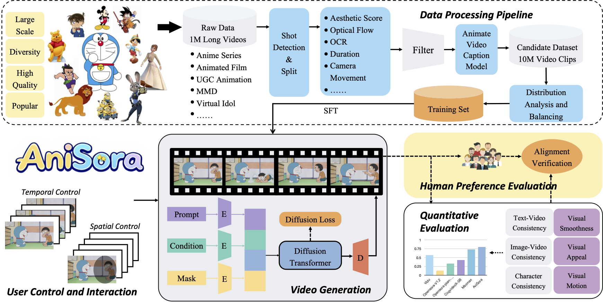
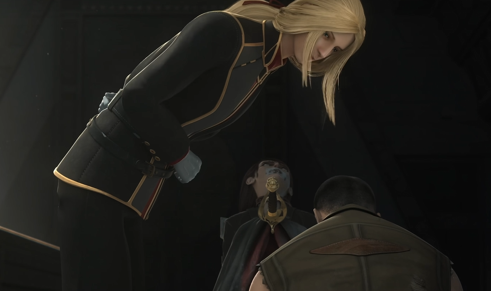
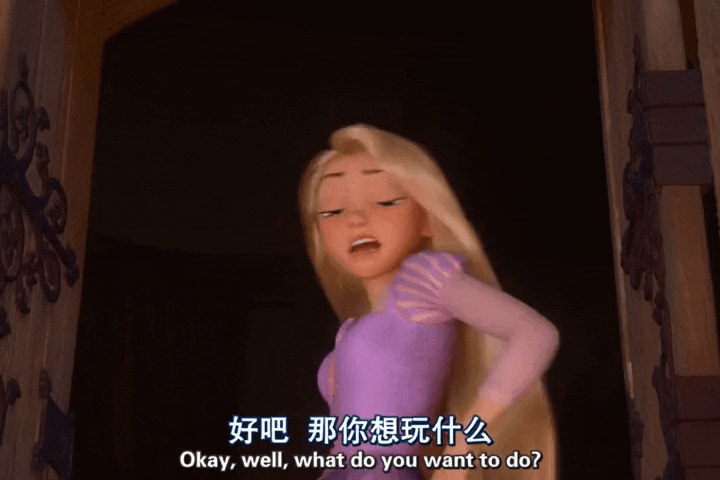
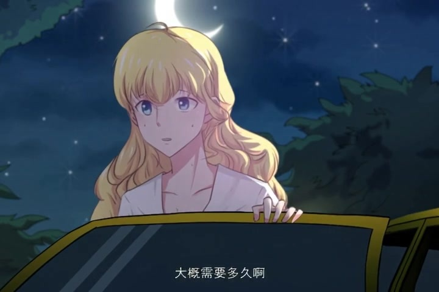
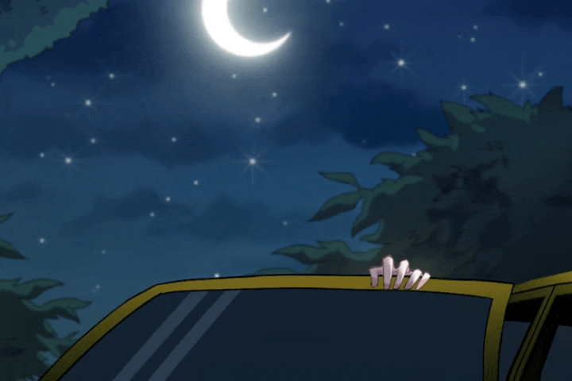
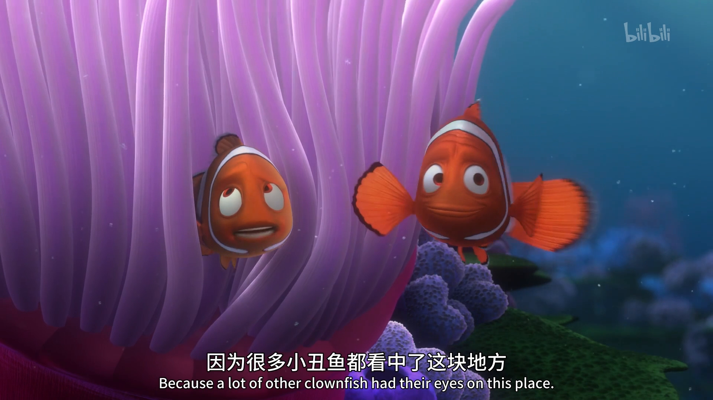
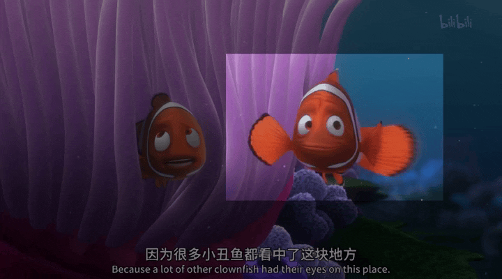
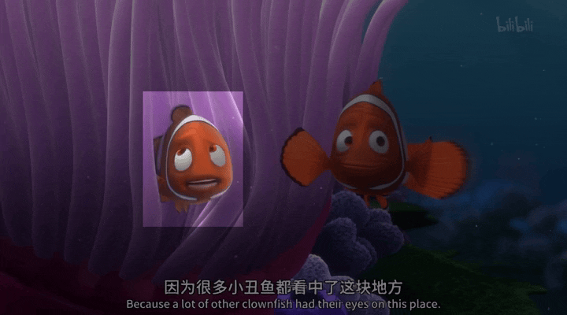

<div align="center">

</div>

<p align="center">
       🖥️  <a href="https://github.com/bilibili/Index-anisora/tree/main">GitHub</a> &nbsp&nbsp  |  &nbsp&nbsp🤗 <a href=https://huggingface.co/IndexTeam/Index-anisora>Hugging Face</a>&nbsp&nbsp |  &nbsp&nbsp🤖 <a href=https://www.modelscope.cn/organization/bilibili-index>Model Scope</a>&nbsp&nbsp | 📑 <a href='http://arxiv.org/abs/2412.10255'></a> &nbsp&nbsp ｜  📑 <a href='http://arxiv.org/abs/2504.10044'></a> &nbsp&nbsp
<br>

<p align="center">

**中文简体** | [**English**](./README.md)

<br>


----

[**Index‑AniSora：终极开源动漫视频生成模型**](http://arxiv.org/abs/2412.10255) <be>

本项目是哔哩哔哩献给二次元世界的礼物——**Index‑AniSora**，目前最强大的开源动漫视频生成模型。  
它支持一键生成多种动漫风格的视频镜头，包括番剧片段、国创动画、漫画改编、VTuber 内容、动画 PV、鬼畜（MAD）等！  
该项目基于我们已被 IJCAI ’25 录用的论文  
<a href='http://arxiv.org/abs/2412.10255'>*AniSora: Exploring the Frontiers of Animation Video Generation in the Sora Era*</a>  

## 🎬 视频演示

<div align="center">
    <video src="https://github.com/user-attachments/assets/0fe90036-7634-4d98-9a7e-6719d2acdb48" controls width="60%" poster=""></video>
</div>

> **VTuber 演示**  
> 下方视频中的每个镜头均使用首帧引导方法生成，首帧取自 B 站 VTuber 舞蹈视频。

| 提示词 (prompt) | 首帧图片 | 生成视频 |
| --- | --- | --- |
| 视频中，一位白发少女随着镜头推进起舞。她一边唱歌，一边右手朝镜头旋转并张开五指。|  |  |
| 视频中，五位少女随着镜头推进起舞，她们唱歌的同时举起左手过头顶，然后放至膝盖位置。|  | |

<div align="center">
    <video src="https://github.com/user-attachments/assets/c932535b-2c12-4353-9a92-e5f5f6c21cbb" controls width="60%" poster=""></video>
</div>

## 📣 更新日志

- `2025/05/12` 🔥 **所有成果均已开源，欢迎查看！**  
- `2025/05/10` 🔥 论文被 IJCAI ’25 接收，已更新定稿版本。  
- `2024/12/19` 项目及评测基准首次在 arXiv 发布。

## 项目指南

### AniSora V1.0
位置：📁 `anisoraV1_infer`

- 基于 **CogVideoX‑5B** 基础模型训练，完整训练与推理代码开源  
- 支持 **局部区域控制**、**时间控制**（首帧/尾帧/关键帧插帧、多帧引导）  
- 在 📁 `anisoraV1_train_npu` 提供完整训练代码  
- 可在 RTX 4090 上经济部署  
- 覆盖 80 % 应用场景

### AniSora V2.0
位置：📁 `anisoraV2_gpu`, `anisoraV2_npu`

- 基于升级后的 **Wan2.1‑14B** 基础模型，稳定性更佳  
- 蒸馏加速推理，无损画质，更快更省  
- 原生支持华为 Ascend 910B NPU（全流程国产芯片训练）  
- 高质量镜头生成，覆盖 90 % 应用场景

### 生态工具
位置：📁 `data_pipeline`

- 端到端数据集流水线，快速扩充训练数据  
- 动画数据清洗管道

### 面向动漫的评测体系
位置：📁 `reward`

- 为动漫视频生成定制的评测模型与打分算法  
- 适用于强化学习和基准测试的奖励模型  
- 与 ACG 审美对齐的标准测试集  
- 人工偏好对齐

该评测数据集包含 948 段动画视频片段，每个动作标签含 10–30 个视频。文本提示先由 Qwen‑VL2 自动生成，再由人工校对以确保文本‑视频对齐。  
填写表格后以 PDF 形式发送至 yangsiqian@bilibili.com 或 xubaohan@bilibili.com（链接在同意协议后提供）。

### AniSora V1.0_RL
位置：📁 `anisora_rl`

- 首个面向动漫视频生成的 RLHF 框架  
- RL 优化后的 AniSora V1.0，可生成更具动漫风格的作品  
- 详见预印本：<a href='http://arxiv.org/abs/2504.10044'>*Aligning Anime Video Generation with Human Feedback*</a>

## 📑 待办列表
- **AniSora V2.0**
    - [ ] 支持 14B 版本，预计 5 月底前发布
- **AniSora 数据集**
    - [ ] **开放高质量训练集申请**
- **AniSora 基准**
    - [ ] 更新最新 SOTA 模型性能

---
## 💡 摘要
动画内容在当今影视行业中备受关注。  
尽管 Sora、Kling、CogVideoX 等先进模型在自然视频生成方面表现出色，但在动漫视频上仍捉襟见肘。  
此外，由于动漫独特的艺术风格、夸张的运动以及对物理规律的打破，也给评测带来了巨大挑战。  

本文提出了完整的系统 **AniSora**，涵盖：  

1. **数据处理流水线**：超过 1000 万高质量数据；  
2. **可控生成模型**：引入时空掩码模块，支持图生视频、帧插值、局部图像引导等关键动画制作功能；  
3. **评测数据集**：收集 948 段多样化动画视频，配套双盲人评实验及 VBench 测试，人物一致性与运动一致性均达到 SOTA。

## 🖥️ 方法

下图展示了 Index‑AniSora 的整体框架：

<picture>
  
</picture>

**主要特点：**

1. 搭建了完整的视频处理系统，显著提升生成前的数据预处理效率；  
2. 提出统一的时空掩码框架，用于动漫视频生成，可同时处理图生视频、帧插值、局部引导等任务；  
3. 发布面向动漫视频生成的专用基准数据集。

## 🎞️ 案例展示

**不同艺术风格的图生视频：**

| 提示词 | 图片 | 视频 |
| --- | --- | --- |
| 画面中，角色坐在前进的汽车里，朝后方挥手，长发在风中左右摆动。|  | .gif)|
| 场景中，两位身着红色婚服的角色拉着红绳，携手远去。|  | .gif)|
| 金发角色伸手轻触跪地之人的头顶，后者喘息起伏。|  | .gif)|
| 视频中，一位白发少女随着镜头推进起舞。她一边唱歌，一边右手朝镜头旋转并张开五指。|  |  |
| 视频中，五位少女随着镜头推进起舞，她们唱歌的同时举起左手过头顶，然后放至膝盖位置。|  | |
| 画面中，一人高速冲刺向前，速度导致动作出现轻微拖影。|  | |
| 画面中，角色抬起手臂，手臂表面有气流流动效果。|  | |
| 老人目光锁定宝石，右手微调放大镜，似在揭示古老秘密。|  | |
| 左侧男子紧抿双唇，面露愤怒与决然；右侧男子张口欲言。|  | |
| 岩石爆炸，耀眼光芒四射，碎片向四周激射。|  | |

**时间控制示例：**

| 提示词 | 首帧 | 中间帧 | 末帧 | 视频 |
| --- | --- | --- | --- | --- |
| 动画电影《美女与野兽》场景：贝儿身着紫色礼服，站在落地窗前对窗外说话，金发披肩。|  | | ||
| 夜晚，一位金发女子在车门后探出身子向外张望，星空与满月照亮场景，她神情担忧。|   | 无 | ||
| 一只卡通猫闭眼张口，似在捣蛋或好奇中，准备惊叫。| 无 | 无 |||

**空间控制示例：**

| 提示词 | 首帧 | 运动掩码 | 视频（含掩码可视化） |
| --- | --- | --- | --- | 
| 在《海底总动员》的缤纷水下世界里，小丑鱼马林和尼莫在大型紫色珊瑚附近交谈……|  | ||
| 同上 | 同上 | ||

**<span style="font-size:18px;"> 更多示例视频： [作品画廊](https://pwz4yo5eenw.feishu.cn/docx/XN9YdiOwCoqJuexLdCpcakSlnkg) </span>**

## 📑 评测结果

**VBench 结果：**

| 方法 | 运动平滑度 | 运动得分 | 美学质量 | 成像质量 | I2V 主体 | I2V 背景 | 整体一致性 | 主体一致性 |
|--------------------------|-------------------|--------------|-------------------|-----------------|-------------|----------------|---------------------|---------------------|
| Opensora‑Plan(V1.3)  | 99.13 | 76.45 | 53.21 | 65.11 | 93.53 | 94.71 | 21.67 | 88.86 |
| Opensora(V1.2)       | 98.78 | 73.62 | 54.30 | 68.44 | 93.15 | 91.09 | 22.68 | 87.71 |
| Vidu                 | 97.71 | **77.51** | 53.68 | 69.23 | 92.25 | 93.06 | 20.87 | 88.27 |
| CogVideo(5B‑V1)      | 97.67 | 71.47 | **54.87** | 68.16 | 90.68 | 91.79 | 21.87 | 90.29 |
| MiniMax              | 99.20 | 66.53 | 54.56 | **71.67** | 95.95 | **95.42** | 21.82 | 93.62 |
| **AniSora**          | **99.34** | 45.59 | 54.31 | 70.58 | **97.52** | 95.04 | 21.15 | **96.99** |
| AniSora‑K            | 99.12 | 59.49 | 53.76 | 68.68 | 95.13 | 93.36 | 21.13 | 94.61 |
| AniSora‑I            | 99.31 | 54.96 | 54.67 | 68.98 | 94.16 | 92.38 | 20.47 | 95.75 |
| GT                   | 98.72 | 56.05 | 52.70 | 70.50 | 96.02 | 95.03 | 21.29 | 94.37 |

**AniSora 基准结果：**

| 方法 | 人工评分 | 视觉平滑 | 视觉运动 | 视觉吸引力 | 文本‑视频一致 | 图像‑视频一致 | 角色一致性 |
|--------------------------|------------------|---------------|---------------|---------------|------------------------|-------------------------|-----------------------|
| Vidu‑1.5                 | 60.98            | 55.37         | **78.95**     | 50.68         | 60.71                  | 66.85                   | 82.57                 |
| Opensora‑V1.2            | 41.10            | 22.28         | 74.90         | 22.62         | 52.19                  | 55.67                   | 74.76                 |
| Opensora‑Plan‑V1.3       | 46.14            | 35.08         | 77.47         | 36.14         | 56.19                  | 59.42                   | 81.19                 |
| CogVideoX‑5B‑V1          | 53.29            | 39.91         | 73.07         | 39.59         | 67.98                  | 65.49                   | 83.07                 |
| MiniMax‑I2V01            | 69.63            | 69.38         | 68.05         | **70.34**     | **76.14**              | 78.74                   | 89.47                 |
| **AniSora (Ours)**       | **70.13**        | **71.47**     | 47.94         | 64.44         | 72.92                  | **81.54**               | **94.54**             |
| AniSora (Interpolated Avg) | -             | 70.78         | 53.02         | 64.41         | 73.56                  | 80.62                   | 91.59                 |
| AniSora (KeyFrame Interp) | -             | 70.03         | 58.10         | 64.57         | 74.57                  | 80.78                   | 91.98                 |
| AniSora (KeyFrame Interp) | -             | 70.03         | 58.10         | 64.57         | 74.57                  | 80.78                   | 91.98                 |
| GT                       | -                | 92.20         | 58.27         | 89.72         | 92.51                  | 94.69                   | 95.08                 |

> **说明**  
> *AniSora*：我们的 I2V 结果  
> *AniSora‑K*：关键帧插帧结果  
> *AniSora‑I*：帧插值（平均）结果

## 🐳 基准数据集

该基准数据集包含 948 段动画视频片段，每段标注不同动作。每个标签含 10–30 个视频，文本提示由 Qwen‑VL2 生成并经人工校对，确保文本‑视频对齐。  
请填写 <a href="assets/anisora_benchmark_agreement_form.doc">申请表</a> 并将 PDF 发送至 yangsiqian@bilibili.com 或 xubaohan@bilibili.com（须先同意 B 站协议）。

## 🤗 致谢
特别感谢 [CogVideoX](https://github.com/THUDM/CogVideo)、[Wan2.1](https://github.com/Wan-Video/Wan2.1)、[FasterCache](https://github.com/Vchitect/FasterCache) 以及 [OSS](https://github.com/bebebe666/OptimalSteps) 的宝贵工作。

## 📚 引用

如果本项目对您有帮助，请为我们的仓库点 Star，并引用下述论文：

```
@article{jiang2024anisora,
  title={AniSora: Exploring the Frontiers of Animation Video Generation in the Sora Era},
  author={Yudong Jiang, Baohan Xu, Siqian Yang, Mingyu Yin, Jing Liu, Chao Xu, Siqi Wang, Yidi Wu, Bingwen Zhu, Xinwen Zhang, Xingyu Zheng,Jixuan Xu, Yue Zhang, Jinlong Hou and Huyang Sun},
  journal={arXiv preprint arXiv:2412.10255},
  year={2024}
}
```
